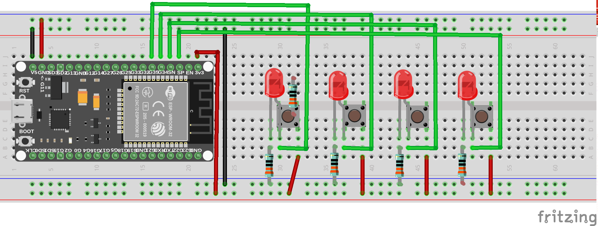

# Overview

Reading digital switch inputs using the rising and falling edge-detect interrupt method.

This is one method of dealing with noisy physical switches that are used as 
actuators in control systems. The input signals are debounced and verified
and then published on a queue "DigitalInput::gpio_input_queue"
The debouncing is necessary because the many jittery input transcients can 
cause the edge-detection interrupts to not fire. 

There are 3 parameters used in debouncing:

GPIO_INPUT_DEBOUNCE_DEPRESS_TIME, set to wait for 20ms on depression of the actuator before noting it as a logical 1.
GPIO_INPUT_DEBOUNCE_RELEASE_TIME, set to wait for 200ms on release of the actuator before noting it as a logical 0.
GPIO_INPUT_DEBOUNCE_SETTLE_TIME, set to 400ms to check if the current state actually does correspond to the recorded state. If not, the recorded state is corrected.

# Usage:

Create a class instance for each of the digital interrupts, and indicate the GPIO, name and a description.

In your main application, read the pointer from the DigitalInput instances from queue DigitalInput::gpio_input_queue.

# Example:

See main.cpp: 4 instances of class DigitalInput are created and then a task ReadQueueTask reads the queue DigitalInput::gpio_input_queue
and displays the active results. The main programm displays the recorded states of these 4 classes. They should be same. 
A supervisory task corrects them if they are not.

